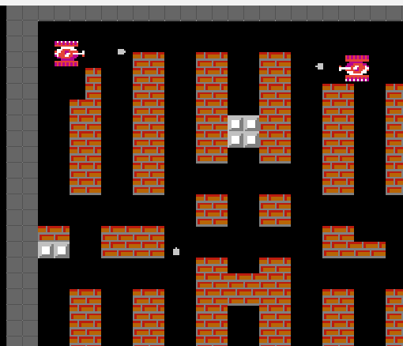

# Battle City — Java

A faithful clone of the classic 1985 NES game **Battle City**, written from scratch in
Java with AWT/Swing. You drive a tank through 35 walled stages, destroying waves of
enemy tanks while protecting your base (the eagle) from being overrun.

This project was built as the **final assignment for the Object-Oriented Programming
(POO) course**, so it doubles as a practical showcase of OOP design: an inheritance
hierarchy of game entities, polymorphic update/draw loops, encapsulated game state, the
Singleton pattern for shared resources, and a hand-written tile-based collision system.



## Features

- **35 stages** loaded from plain-text tile maps (`stages/1` … `stages/35`).
- **Tile-based collision** between tanks, bullets and the four terrain types.
- **Destructible & solid terrain**: brick walls (destructible), steel walls (need an
  upgraded tank), forest (cover that hides tanks), and water (blocks movement).
- **Enemy tank AI** (`TankAI`) with several tank types of differing speed and armor.
- **Six power-ups**: Star (weapon upgrade), Tank (extra life), Shield (temporary
  invulnerability), Clock (freezes enemies), Shovel (fortifies the base), and Bomb
  (clears on-screen enemies).
- **Sprite animation, sound effects** (`javax.sound.sampled`) and a custom pixel font
  (`prstart.ttf`) for an authentic NES feel.
- **Scoreboard** with per-stage statistics between levels.

## Tech stack

- **Language:** Java SE (compiles and runs on JDK 8 through 24).
- **Graphics/UI:** AWT + Swing (`GameView` form, `Board` render loop) — a **headful**
  JDK is required.
- **Audio:** `javax.sound.sampled`.
- **Dependencies:** none — pure Java SE, no build tool and no third-party libraries.

## Object-oriented design

Built as the POO final project, the codebase is organised around a small class hierarchy:

- `Sprite` is the base class; concrete entities (`Tank`, `Bullet`, `Brick`, `Steel`,
  `River`, `Tree`, `Base`, `Explosion`, `PowerUp`, …) extend it and override the
  rendering/update behaviour polymorphically.
- `ImageUtility` and `SoundUtility` use the **Singleton** pattern to share loaded assets.
- `CollisionUtility`, `BoardUtility` and `Map` separate collision, board logic and
  stage parsing from the entities themselves.

The full UML class diagram and the course report are in [`docs/`](docs/).

## Controls

| Key            | Action                          |
| -------------- | ------------------------------- |
| Arrow keys     | Move the tank (up/down/left/right) |
| Spacebar       | Fire                            |
| Enter          | Start / confirm menu / pause    |

On the title screen, use the arrow keys to pick **1 PLAYER** / **2 PLAYER** and press
**Enter** to start.

## Build & run

There is no build tool — the game is compiled directly with `javac`. Because images,
sounds, stage maps and the font are loaded with paths relative to the working directory,
**you must compile and run from the project root** (the folder that contains `src/`,
`images/`, `sounds/` and `stages/`).

### 1. Clone the repository

```bash
git clone https://github.com/EduardoTBuss/JavaBattleCity
cd JavaBattleCity
```

### 2. Check that a headful JDK is available

```bash
java -version
javac -version
```

Any JDK from 8 onwards works (verified on JDK 24). A headful JDK and a graphical display
are required because of AWT/Swing.

### 3. Compile all sources into an `out/` directory

```bash
mkdir -p out
javac -d out $(find src -name "*.java")
```

On Windows PowerShell, replace the last line with:

```powershell
javac -d out (Get-ChildItem -Recurse src -Filter *.java).FullName
```

### 4. Run the game (main class `GameMain.GameMain`)

```bash
java -cp out GameMain.GameMain
```

### Optional: build a runnable JAR

```bash
cd out
echo "Main-Class: GameMain.GameMain" > manifest.txt
jar cfm ../BattleCity.jar manifest.txt $(find . -name "*.class")
cd ..
java -jar BattleCity.jar
```

> The JAR must still be launched from the project root so that `images/`, `sounds/` and
> `stages/` are found.

## Project structure

```
JavaBattleCity/
├── src/
│   ├── GameMain/      # game loop, board, menus, map parsing, resource utilities
│   └── Entities/      # Sprite hierarchy: tanks, bullets, terrain, power-ups, effects
├── images/            # sprite sheets and individual PNG sprites
├── sounds/            # WAV sound effects
├── stages/            # 35 text-based tile maps (1 … 35)
├── docs/              # UML class diagram and POO course report
├── prstart.ttf        # custom pixel font
├── LICENSE
└── README.md
```

### Stage map format

Each stage file is an ASCII grid where one character is one tile:

| Symbol | Tile          |
| ------ | ------------- |
| `.`    | empty         |
| `#`    | brick wall    |
| `@`    | steel wall    |
| `%`    | forest        |
| `~`    | water         |

## Credits

Developed by **Érick Radmann**, **Eduardo Timm Buss** and **Diogo Pereira Ribeiro** as
the final project for the Object-Oriented Programming course. Sprites are from the
[Spriters Resource Battle City sheet](https://www.spriters-resource.com/nes/batcity/asset/60016/).
Battle City is a trademark of Namco; this is a non-commercial, educational reimplementation.

## License

Released under the [MIT License](LICENSE).
